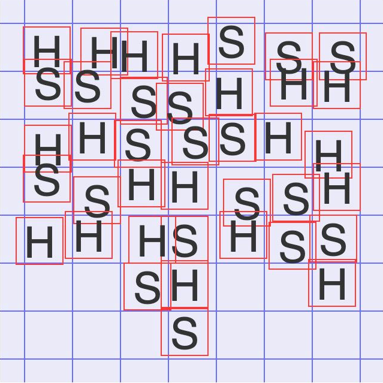

Для выставки, посвящённой развитию искусственного интеллекта, решили создать интерактивный арт-объект, который помог бы каждому посетителю осознать, что такое технологическая сингулярность — момент истории, когда ИИ превзойдёт интеллект всего человечества.

В одном из залов всем посетителям будет предложено сыграть в несложную логическую игру. На поле 10 x 10 участники поочерёдно ставят свои фишки: сначала человек, потом ИИ. Выигрывает тот, кто соберёт пять своих фишек в ряд (по горизонтали, вертикали либо диагонали), что будет означать господство над природой и контроль над пятью первоэлементами: огнём, водой, землёй, воздухом и эфиром.

Ваша задача — написать программу, которая будет определять победителя в этой неравной схватке либо ситуацию, когда победителя уже может не быть.

Ваше решение должно быть оформлено в виде функции, которая принимает следующие аргументы:

container — элемент DOM, представляющий игровое поле;
size — количество строк и столбцов игрового поля (например, 10 для поля 10x10), значение не меньше 5;
onEndGame — функция, которую должно вызвать ваше решении при фиксации окончания игры.
Игра заканчивается, если один из игроков победил либо образовалась ситуация, когда ни один игрок уже не сможет победить. По завершении игры вы должны вызвать функцию onEndGame, передав следующие аргументы:

movesCount — за сколько ходов завершилась игра;
winner — символ игрока-победителя: H — если победил человек,
S — если победил ИИ, P — если игра завершилась ничьёй.
Примечания
При каждом ходе игры в контейнер будет добавляться div-элемент с текстом "H" или "S" и удаляться при ходе следующего игрока. Таким образом в каждый момент времени на поле будет присутствовать ровно один элемент.

Нужно учитывать, что у контейнера, являющегося игровым полем, заданы внутренние отступы (одинаковые для всех сторон).

Добавляемые элементы не обязаны располагаться ровно по сетке игрового поля, но гарантируется, что каждый добавляемый элемент будет иметь максимум по площади ровно с одной клеткой, образованной равномерной сеткой игрового поля.

На рисунке изображен пример того, как может выглядеть игровое поле и какие координаты могут иметь элементы, представляющие собой ходы игроков:

Исходный код нужно оформить следующим образом:

function solution(container, size, onEndGame) {  
    // ваше решение
}
Функция solution будет вызвана один раз перед первым ходом игры.

Функция onEndGame имеет сигнатуру onEndGame(movesCount, winner) и должна быть вызвана ровно один раз по завершении игры.